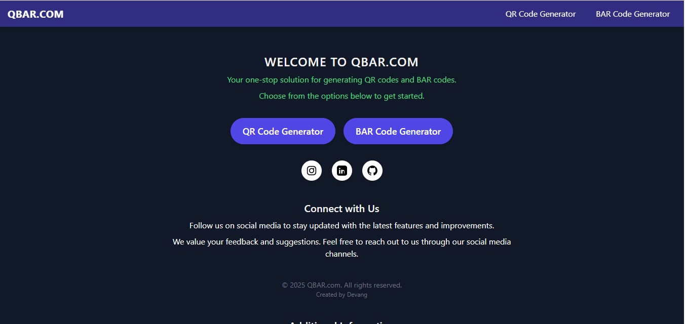
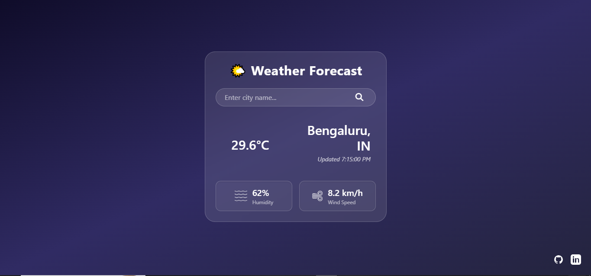
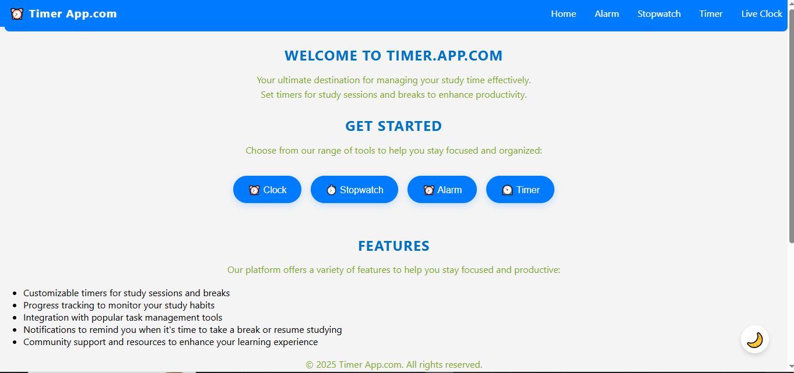

# 🚀 My Projects Hub

A modern, responsive **Project Showcase Website** built using **HTML & CSS**. This hub organizes all my web projects in a clean card-based layout for easy access and presentation.

---

## 🌐 Live Demo

---

## ✨ Features

* 🎨 Modern UI with gradient background
* 📱 Fully responsive and mobile-friendly
* 🧩 Card-based project showcase
* ⚡ Smooth hover animations
* 🔗 Direct links to live projects
* 🏎 Lightweight & fast, no frameworks required

---

## 🛠 Built With

---

## 📂 Projects Included

| Project                  | Preview                       | Link                                                                  |
| ------------------------ | ----------------------------- | --------------------------------------------------------------------- |
| QR & Barcode Generator   |            | [Visit Site](https://Devangdaksh.github.io/QRandBAR.code.generater/)  |
| Weather App              |    | [Visit Site](https://yourusername.github.io/Weather.site)             |
| Clock App                |      | [Visit Site](https://devangdaksh.github.io/clocky/)                   |
| YouTube Downloader (WIP) |  | [Visit Site](https://yourusername.github.io/youtube-video-downloader) |

## 🎨 Customization

* Replace project links with your own URLs
* Update images inside `/image` folder
* Modify CSS colors to match your theme
* Add more project cards by duplicating `.card` blocks

---

## 🔮 Future Improvements

* Dark/Light mode toggle 🌗
* Add animated interactions (GSAP/Framer Motion)
* Dynamic project loading with JSON or API
* Enhanced accessibility features

---

## 👤 Author

**DEVANG**

---

## ⭐ Support

If you like this project:

* ⭐ Star this repo
* 🍴 Fork it
* 📢 Share it

---
